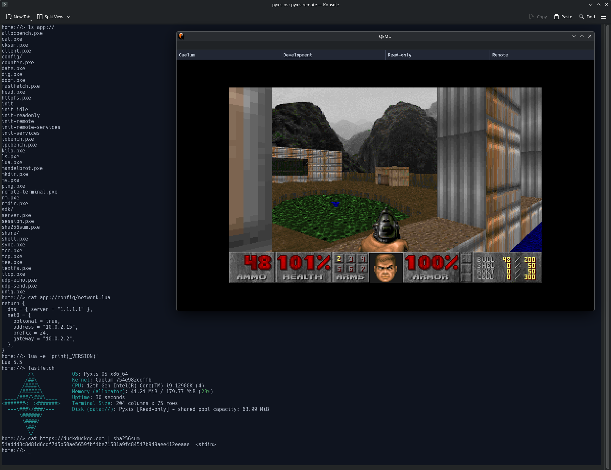

# Pyxis OS

Caelum is the freestanding GNU C23 x86_64 kernel of Pyxis OS. Development targets
QEMU booted through OVMF/UEFI and Limine, with a native userspace and capability ABI.



Doom in the Development space, alongside a remote shell showing native filesystem
information and piping an HTTPS response into `sha256sum`.

Requires GNU Make, a host C compiler, the [Pyxis GCC/binutils toolchain](toolchain/README.md)
(or its LLVM toolchain with `TOOLCHAIN=llvm`),
QEMU, GNU cpio, xorriso, host Lua 5.4, Python 3 with
[Kconfiglib](docs/development/configuration.md), and a matching raw OVMF code/variables pair.
Userspace, ports, lwIP and the filesystem format library are [pinned submodules](docs/development/sdk-and-repositories.md).
See [port builds](docs/development/ports.md) for application dependencies. CI publishes
[independent build bundles](docs/development/build-bundles.md) for local reuse.

```sh
git submodule update --init userspace ports third_party/lwip fs
make menuconfig          # optional; .config can also be edited directly
make -j16                 # kernel: build/caelum.elf
make -j16 image           # kernel, userspace and ports: build/pyxis.iso
make sdk                  # export build/sdk; see docs/development/sdk.md
make fs-tools             # opt-in host formatter/inspector
make run CPUS=4
make run CPUS=8 THREADS=2 # four cores with two threads each
make run CPUS=4 VIRTIO_NET=1
make run CPUS=4 QEMU_VIDEO=virtio
make run CPUS=4 QEMU_VIDEO=bochs DISPLAY_SIZE=800x600
make run ACCEL=tcg        # software emulation when KVM is unavailable
make image INIT=/tmp/init.sh  # optional native PXE or shebang init
make run LOG_LEVEL=trace  # include scheduler idle diagnostics
make debug CPUS=4        # paused; see docs/development/gdb.md
make clean
```

Make defaults to KVM, one CPU, 8 GiB RAM and GTK display. Override
`CROSS_COMPILE`, `QEMU`, `CPUS`, `THREADS`, `MEMORY`, `ACCEL`, `QEMU_DISPLAY`, `OVMF_CODE`
and `OVMF_VARS` on the command line as needed. Firmware defaults are
`/usr/share/OVMF/x64/OVMF_CODE.4m.fd` and `OVMF_VARS.4m.fd` in the same directory;
select matching paths for your distribution. Each run copies firmware variables
into build. Serial uses the launching terminal; exit QEMU with Ctrl-a x.
A guest `poweroff` also exits QEMU, and `reboot` restarts the guest.
`QEMU_NO_REBOOT=1` makes a reset, including a triple fault, stop QEMU instead.
`QEMU_DISPLAY=none` disables the graphics window. `QEMU_VIDEO=virtio` selects
VirtIO GPU 2D; the default uses standard VGA. `QEMU_VIDEO=bochs` selects the
separate Bochs device; `DISPLAY_SIZE=WIDTHxHEIGHT` sets the image's initial Bochs
mode for either VGA or Bochs. See [display selection](docs/development/qemu.md#display-device).
`VFIO_PCI=0000:05:00.0` opts into [PCI passthrough](docs/development/qemu.md#pci-passthrough),
after the [host setup](docs/development/thinkpad-nic-passthrough.md#host-setup).

The first tab is Caelum's live kernel log, and boot starts there. Super+Right
selects the Development shell, then the Read-only host-access session, then
Remote, which starts the [remote terminal server](docs/userland/remote-terminal.md).
Super+Left/Right stops at either end, and the tab bar scrolls when the spaces
do not fit. Every CPU count gets the same spaces. Boot init creates them from
the [boot configuration](docs/userland/init.md#boot-configuration), and the init
scripts hand off to sessions.

The shell starts at `tmp://`, which is RAM-backed and lost on reboot. `boot://`
contains the read-only boot archive; installed systems run ordinary programs from
`bin://`, which live boots bind to the archive. Optional [virtio-fs setup](docs/devices/virtio-fs.md)
provides persistent `host://` files and executable loading; no overlay is needed.
`VIRTIO_NET=1` adds a QEMU NIC; see [network setup](docs/devices/networking.md)
for initial link selection and explicit profiles.
[Block storage](docs/devices/block-storage.md) is opt-in with
`VIRTIO_BLK_IMAGE=/path/to/disk.raw`.
The opt-in [raw USB image](docs/development/usb-image.md) builds a FAT32/GPT
installation image and boots it through emulated USB with `make run-usb`.
[Native filesystem mounts](docs/userland/init.md#native-disk-configuration-and-mounting)
use `MOUNT_DISK` configuration and an explicit read-only or writable mount in
trusted init. File/directory sync provides durability; close does not.
Normal boot has no menu delay. Set `BOOT_MENU_TIMEOUT=5` when building install
media to show the menu for five seconds. Its separate
[Install Pyxis entry](docs/userland/installer.md) launches the native installer
with raw-disk authority through trusted init. Installation rebuilds the selected
disk after consent and typed `wipe`; installed normal boot mounts `system://`.
See [QEMU troubleshooting](docs/development/qemu.md) for host emulator boot failures.
The [shell guide](docs/userland/shell.md) and [edit/build/run walkthrough](docs/development/edit-build-run.md)
cover ordinary guest use.

The scheduler places and balances processes across the CPUs their space allows,
excluding the BSP on multicore boots. The BSP owns kernel allocation, VM mutation
and cleanup, and runs preemptible kernel tasks; user syscall paths remain
non-preemptible. See [SMP ownership](docs/kernel/smp.md), [userspace](docs/kernel/userspace.md)
and [memory](docs/kernel/memory.md). Low-level allocation contracts live in
[PMM](include/kernel/mm/pmm.h), [VM](include/kernel/mm/vm.h) and
[heap](include/kernel/mm/heap.h) headers. Task migration, cross-CPU TLB shootdowns,
AVX and physical-hardware support remain outside the current implementation.

Find subsystem references in the [documentation guide](docs/README.md).
For development, follow [AGENTS.md](AGENTS.md) and the
[milestone index](docs/wip/boot-sdk-ports.md). BOOTSTRAP.md is the historical
bring-up assignment, not the current scope.

## License

Original Pyxis material is licensed under [MPL-2.0](LICENSE). See
[LICENSING.md](LICENSING.md) for scope and third-party exceptions.
