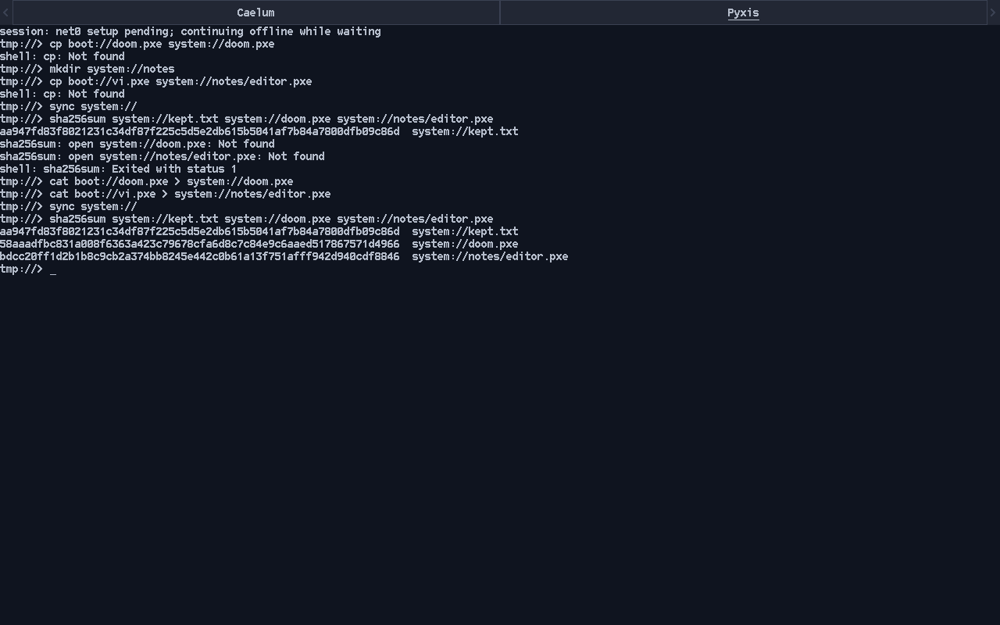

# Read-only npfs FUSE qualification

Manual validation on 2026-10-06 for
[task 1](../../../wip/npfs-fuse.md). Implementation and QEMU/loop-device checks
are complete. The owner's ThinkPad-stick mount and file copy remain outstanding,
so the milestone's task-1 checkbox remains open.

## Revisions and environment

Parent baseline `8544220` is current main with the accepted milestone. The guest
used its pinned fs `d352c7e`, userland `c3d5668` and ports `0ead472`.
Host baseline readers were built separately from filesystem main `9e1a63f`;
its format/tool source is identical to the parent's pin. The new mount's
executable source is fs `d5042f5`; published `3f527a4` adds only runtime-package
and dependency-license documentation. The parent integration pins that published
revision.

Host Fedora 44, Linux `6.19.10-300.fc44.x86_64`, host GCC 16.2.1, Pyxis GCC
16.2.0, libfuse3 3.18.3. QEMU 10.2.2 with the existing AHCI correction,
q35 nested KVM, `-cpu max`, four CPUs, 2 GiB RAM, OVMF CODE and a fresh VARS
copy. The 2 GiB target was a disposable sparse regular file on `/dev/shm`,
exposed through modern VirtIO block with 512-byte sectors and writeback cache;
entropy used VirtIO RNG. The guest disabled xHCI and used the 30-second npfs
background flush interval. No network adapter was needed.

A full current-main source build passed using the existing cross compiler.
The ordinary packaged installed init mounted the selected disk's partition 2
read-write as `system://`; no new init program or boot harness was introduced:

```sh
PATH=/home/chronium/src/pyxis-native-writer-build/host-tools/bin:$PATH \
make -j16 image fs-tools \
  CROSS_COMPILE=/home/chronium/opt/pyxis-cross/bin/x86_64-unknown-pyxis- \
  PYTHON=/usr/bin/python3
# Image assembly selected the existing packaged installed init:
make -j16 image SPACES=pyxis=boot://init-installed \
  MOUNT_DISK=6faa2e3f-2f4d-4b9b-9265-17fd889cd402
```

The compiler/Python/Lua settings above were retained for the second invocation.
The validation-only `.config` change was restored before committing. Host builds
passed both standalone `make -j16` and parent `make -j16 fs-tools`. With
`PKG_CONFIG=false` and a separate build directory, ordinary tools still built;
explicit `make npfs-fuse` refused with the development-package requirement.
No tests, committed fixtures, fault hooks, boot/output automation or CI jobs were
added. Existing warnings from vendor sources remain; the host tools build with
`-Werror`.

## Guest files and Linux readback

The target started as an earlier finalized installation with a synced 661-byte
`kept.txt`. In the current-main guest, ordinary shell commands made two more files
and a directory, then synced the pool and reported SHA-256 values:

```text
cat boot://doom.pxe > system://doom.pxe
mkdir system://notes
cat boot://vi.pxe > system://notes/editor.pxe
sync system://
sha256sum system://kept.txt system://doom.pxe system://notes/editor.pxe
```

An initial attempt to use `cp` reported not found; that program is not packaged.
Native `cat` redirection completed the copies. QEMU was stopped after successful
sync and hash reporting, before Linux opened the source. The pool was extracted
without modification from the RAM-backed disk:

```sh
dd if=disk.raw of=pool.raw bs=4096 skip=131328 count=392955 conv=sparse status=none
build/fs-tools/fsck.npfs --image pool.raw
build/fs-tools/npfs-fuse -f pool.raw /dev/shm/pyxis-npfs-fuse/mount
```

Host fsck reported `structural check passed`. FUSE listed `system/`, its files
and `notes/`, owned by the mounting UID/GID with directory mode 0555 and file
mode 0444. Linux `sha256sum` matched every value reported inside Pyxis:

| Path under `system/` | Bytes | SHA-256 |
| --- | ---: | --- |
| `kept.txt` | 661 | `aa947fd83f8021231c34df87f225c5d5e2db615b5041af7b84a7800dfb09c86d` |
| `doom.pxe` | 438384 | `58aaadfbc831a008f6363a423c79678cfa6d8c7c84e9c6aaed517867571d4966` |
| `notes/editor.pxe` | 97296 | `bdcc20ff1d2b1b8c9cb2a374bb8245e442c0b61a13f751afff942d940cdf8846` |



The mounted binary files also matched their immutable boot-source copies with
`cmp`. Linux `cp` copied the nested file out, and that copy matched too. Seeking
to four bytes before EOF and reading eight returned four bytes, then zero on the
next read. A write-open returned `EROFS` (30). A cooperating writable fsck open
while mounted failed on the shared image lock before replay or any write.

The nested file's creation xattr was `1791278967125558420`; its modification
xattr and Linux `st_mtime_ns` both were `1791278967159648720`. The synthetic
mount root returned the literal `unknown` for its native creation xattr. These
are observed timestamp payloads, not fixed expected constants for future runs.
Real unknown inode timestamps, negative dates and signed endpoints were reviewed
in source rather than created by modifying records.

After `fusermount3 -u`, the complete pool's SHA-256 remained
`55c2d7c7118d5453bbcaf0e44a05ec90e2d5d49d57a00de3b9a4e44979e3000e`.
The mount exited successfully and released its source lock.

## Partition, multiple volumes and journal refusal

The stopped RAM-backed disk was attached with existing Linux tools:

```sh
sudo losetup --find --show --read-only --partscan disk.raw
sudo build/fs-tools/npfs-fuse -f /dev/loop0p2 /dev/shm/pyxis-npfs-fuse/mount
```

The loop number above was allocated for this run; select the actual returned
number rather than assuming it on another host. Its npfs partition mounted and
returned the same three hashes. Mounting as root yielded UID/GID 0 and file mode
0444. The existing inspector still refused this block-device source as invalid,
confirming its image-only contract. After root unmount and loop detach, the whole
disk digest remained
`a256d138fc7f096a3dbdcf746a609ba90b076fea2d058c44ebeeeaae66e1aa1b`.
This exercises Linux block-device opening, not physical USB qualification.

An ordinary host formatter invocation created an additional 128 MiB image with
`work` importing the existing format headers and an empty `empty` volume. The
normal daemon mount exposed both names, recursively listed the imported tree
and empty volume, and its header copy matched the original. Normal unmount
completed successfully. This is additional manual tool use, not a new test suite.

Journal refusal used the existing real committed transaction from
[system-update recognition qualification](../system-updates-task1/README.md),
left by killing QEMU after journal commit and before checkpoint home writes.
Its extracted pool was copied to RAM, not mounted or replayed, and refused with:

```text
npfs-fuse: committed journal; boot Pyxis once to recover it, or run
fsck.npfs --image COPY --replay on a copy of the image. Nothing was written.
```

Its complete digest remained
`953befbea53cf2118693848313c4f62e960897515296db614445b0d9905b5793`.
No journal controls or payloads were manufactured for this check.

## Reader comparison and limits

Three original-reader `npfs-inspect cat` runs and three Linux `cat` runs through
the new mount read the same 438384-byte file to `/dev/null` on RAM-backed storage.
`/usr/bin/time` reported 0.00 seconds for every sample, below its useful timing
resolution. Reader-process peak RSS was 1608/1680/1604 KiB for inspection and
2100/2100/1960 KiB for Linux cat. The latter excludes the FUSE daemon, and FUSE
file data was already cached after hash checking. These are coarse observations,
not comparable latency/memory budgets or evidence of no performance regression.
No profiling or physical-device measurement was performed.

Independent read-only review found no blocking correctness finding. Its minor
root I/O diagnostic issue was fixed before publishing; the result is posted on
[filesystem PR #30](https://git.internal/PyxisOS/pyxis-fs/pulls/30). Sparse file
holes, very large directory continuation, resource exhaustion, malformed records
and source-changing races were source-reviewed, not fault-injected. The adapter
requires an unchanged source and checks local namespace records, not global
allocation ownership; whole-pool checking remains fsck's job.

Inputs, ISO, digests, copied file and build logs are retained outside Git under
`/home/chronium/src/pyxis-npfs-fuse-validation/task1/`. All own QEMU/FUSE processes
were stopped and the read-only loop device detached. Physical ThinkPad mount/copy
is still an owner action. Before marking task 1 complete, the owner also needs to
rebuild/publish the builder from the updated `ci/Containerfile` so existing fs CI
compiles the optional target; an old builder's success only checks the targets
whose dependencies are present.
