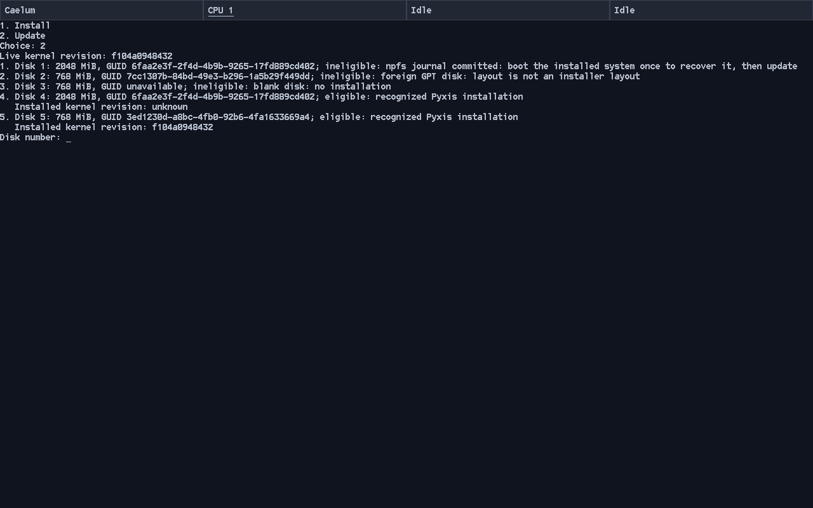
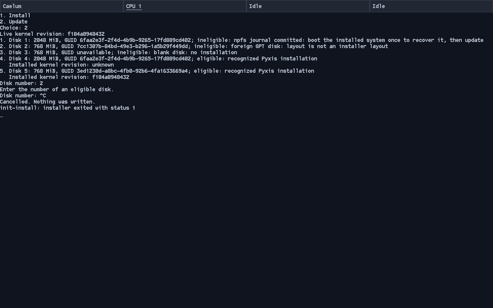
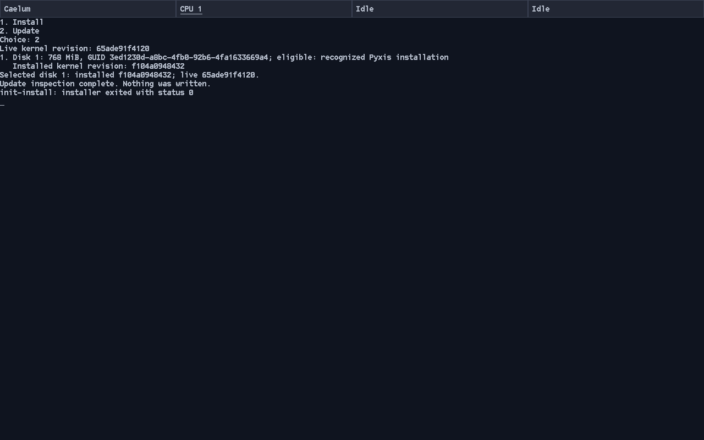

# System-update recognition qualification

Manual validation on 2026-10-04, task 1 of
[system updates](../../../wip/system-updates.md). This qualifies candidate
recognition and revision recording, not ESP updates or complete bootability.

## Inputs and environment

Parent baseline: `f104a0948432` (accepted update plan). Changed sources are this
PR's mount ABI/kernel admission constant and userland
`bcb91c7e03a8da9914646a8d773bc7646d465f3b` (executable source at `dcb5804`, followed
only by its README). Unchanged pins: fs `d352c7e11c5e`, ports `2c1448a26eb5`,
lwIP `a1aadb91a503`. Baseline userland was `2b23085e5f82`.

Host Linux `6.19.10-300.fc44.x86_64`; target GCC 16.2.0. QEMU 10.2.2 with the
existing AHCI backend correction, q35 nested KVM, `-cpu max`, four CPUs, 2 GiB,
OVMF CODE plus a fresh writable VARS copy per boot. Targets were disposable
regular raw image files exposed by modern VirtIO block devices with writeback
cache; entropy used VirtIO RNG. `CONFIG_XHCI=n`, npfs background flush 30 seconds.
Live boot used a CD-ROM ISO and manual Limine selection, then Super+Right to
focus installer CPU 1. A 60-second menu timeout was used for these manual runs.
This is not native USB/ThinkPad, real power-loss or I/O-error qualification.

Ordinary full source builds passed before and after review fixes:

```sh
PATH=/home/chronium/src/pyxis-native-writer-build/host-tools/bin:$PATH \
make -j16 image fs-tools \
  CROSS_COMPILE=/home/chronium/opt/pyxis-cross/bin/x86_64-unknown-pyxis- \
  PYTHON=/usr/bin/python3 BOOT_MENU_TIMEOUT=60
```

The kernel, installer and init compiled without new warnings. Existing vendor
warnings remain. No compiler-container rebuild was needed. No tests, self-tests,
CI jobs or boot/output automation were added.

## Fixtures and observed behavior

| Fixture | Preparation | Update result |
| --- | --- | --- |
| Fresh, 768 MiB | New installer, default 8 MiB journal, `wipe`; installed and verified | Eligible; installed revision `f104a0948432` |
| Finalized older, 2 GiB | Copy of earlier native installation; normal writable mount, remove marker, copy 661-byte hello file to `system://kept.txt`, sync | Eligible without marker; installed revision `unknown` |
| Blank, 768 MiB | New sparse zero-filled raw image | Ineligible: blank disk, no installation |
| Foreign GPT, 768 MiB | Protective GPT with a Linux partition outside installer layout | Ineligible: layout is not an installer layout |
| Committed journal, 2 GiB | Copy of finalized fixture; ordinary guest file creation stopped at checkpoint after durable journal commit | Ineligible: boot installed system once to recover it, then update |

The fresh installation's `boot/revision`, extracted using existing host mtools,
contained `f104a0948432` plus newline. Its installed configuration named the new
GPT GUID, used timeout zero and omitted the Install entry. Normal fresh-writer
FAT traversal and byte comparison included the revision record. Host `fsck.npfs`
on the extracted fresh and finalized older pools reported `structural check
passed`; extraction of `kept.txt` matched the source bytes. The older disk also
booted its original installed system normally before finalization.

The pending fixture was produced through ordinary filesystem calls, not by
manufacturing control bytes. A temporary existing native init script mounted
`system://` and started the existing remote session. While the guest executed
`date > system://pending.txt`, GDB stopped `checkpoint` when
`pool->control.state == 1`. Inspection showed COMMITTED, sequence 10, two images,
one descriptor block and payload CRC 1388863233. QEMU was killed while paused,
before checkpoint applied those images. The remote client disconnected as
expected. This fixture was not mounted or replayed during Update inspection.

With all five disks attached, Update listed the two candidates and all three
reasons, and displayed the live revision once. Choosing the foreign disk number
was rejected; Ctrl+C at the next disk prompt printed `Cancelled. Nothing was
written.` and init reported exit status 1. QEMU block statistics showed zero
write bytes, write requests and flush requests on every target. Full raw-file
SHA-256 checks after quitting QEMU matched the pre-boot digests for all five
files, including the pending journal. This also preserves the finalized file.





A final full source build from submitted parent `65ade91f4120` and published
userland `bcb91c7e03a8` passed. Booting that ISO with only the fresh fixture
selected the sole candidate automatically, displayed installed `f104a0948432`
and live `65ade91f4120`, printed `Update inspection complete. Nothing was
written.`, and exited with status 0. Target writes/flushes remained zero, and its
full-file SHA-256 still matched. Subsequent documentation changes do not alter
the implementation qualified here. All validation QEMU/debugger/client jobs
were stopped.



## Existing Install comparison

One baseline run and one changed-source run used the same marked older disk
and blank disk. Selecting Read the room read 118272 bytes in 35 requests from
the marked target and 1536 bytes in three requests from the blank target in both
runs, measured by QEMU counters immediately before and after consent inspection.
Both offered the same candidates without writes. These are single counter
comparisons, not repeated timing measurements or a latency claim. The changed
run then installed the blank target successfully.

## Inspection limits and review

Final read-only code review found no remaining concrete blocker after fixing
long-name identity matching, duplicate configuration bindings and an installer
journal limit that differed from kernel admission. Header/control degraded-copy
acceptance and 4096-byte logical sector handling were checked in source and
builds, not exercised by these 512-byte-sector runs. Recognition checks metadata
opening compatibility and required FAT/configuration identity; it does not
validate every boot option, EFI/kernel/archive bootability, unrelated FAT files,
ordinary pool file contents or global allocation ownership. Task 2 must recheck
eligibility under exclusive access before writing.

Raw fixtures, ISO/ELF builds, logs, remote transcripts and full SHA-256 records
were retained outside Git at
`/home/chronium/src/pyxis-system-updates-build/system-updates-task1/`.
