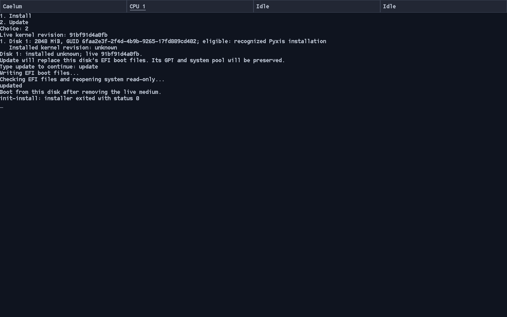
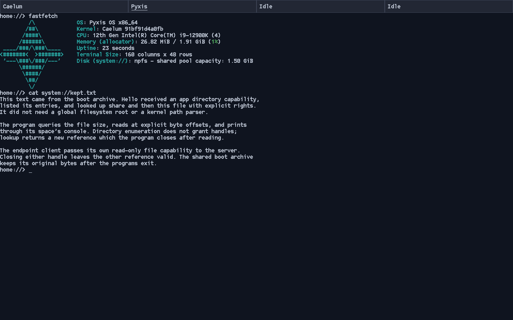
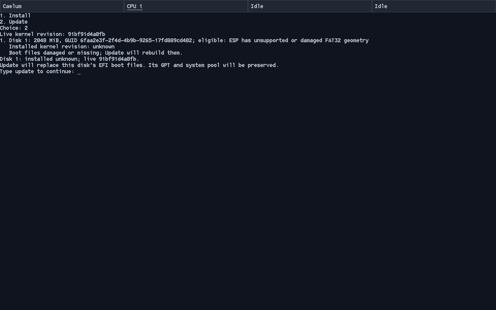
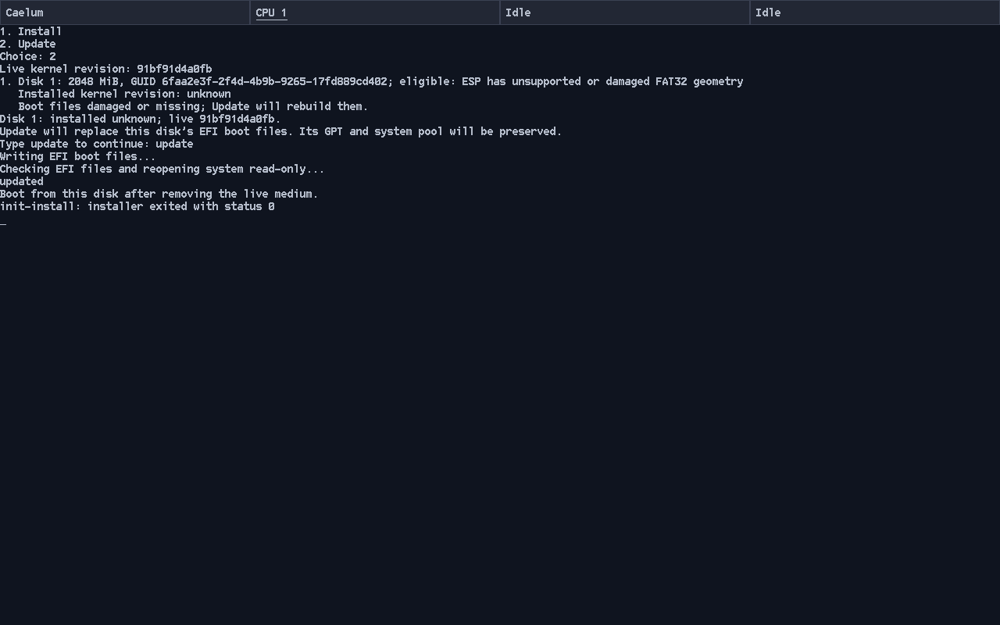

# ESP update and recovery qualification

Manual validation on 2026-10-04, task 2 of
[system updates](../../../userland/system-updates.md).

## Sources and environment

The baseline was parent `91bf91d4a0fb968cf7acc1e1514645dc64dcac50`
with userland `61cad34c0b7586b2acef40274f13385dc5b82837`.
Executable update/recovery sources were userland `6aad43b`; published
`bb4fd660a449c5a572d4dd41e5e0bc7ce61ff7b5` adds only the installer README.
The qualification live kernel reports `91bf91d4a0fb`. Unchanged pins: fs
`d352c7e11c5e`, ports `55b6f8edc0d3`, lwIP `a1aadb91a503`.

Host Linux `6.19.10-300.fc44.x86_64`, target GCC 16.2.0, QEMU 10.2.2 with the
existing AHCI backend correction, q35 nested KVM, `-cpu max`, four CPUs,
2 GiB RAM, OVMF CODE and a fresh writable VARS copy per boot. Disposable regular
raw files used modern VirtIO block, 512-byte logical sectors and writeback cache;
entropy used VirtIO RNG. xHCI was disabled, npfs background flush was 30 seconds.
The live source was a CD-ROM ISO; Limine selection and console input were manual.
A 60-second live menu timeout allowed manual selection. Target-only boots had
no live medium attached. These observations do not qualify physical hardware,
USB raw authority, actual power loss or uncertain I/O failures.

Ordinary full source builds passed, including the two recovery-reader follow-ups:

```sh
PATH=/home/chronium/src/pyxis-native-writer-build/host-tools/bin:$PATH \
make -j16 image fs-tools \
  CROSS_COMPILE=/home/chronium/opt/pyxis-cross/bin/x86_64-unknown-pyxis- \
  PYTHON=/usr/bin/python3 BOOT_MENU_TIMEOUT=60
```

The modified installer compiled without new warnings; existing vendor warnings
remain. No new tests, self-tests, CI jobs or boot/output automation were added.
No compiler-container rebuild was needed.

## Finalized installation and successful update

The 2 GiB finalized older fixture from the
[recognition qualification](../system-updates-task1/README.md) had no
`SAFE_TO_WIPE` marker or revision record, and contained the synced 661-byte
`system://kept.txt`. Its original system had already booted normally.
Independent copies were used for normal Update and interruption/recovery.
The baseline full-file SHA-256 was
`192ba20e5fc50e6606ac5eb19ddae116b0ec0243d4349be1e5a1c88a997f264d`.

The candidate displayed installed `unknown`, live `91bf91d4a0fb` and disk GUID
`6faa2e3f-2f4d-4b9b-9265-17fd889cd402`. Cancelling at typed confirmation before
the write qualification left the whole raw image byte-identical to baseline.
After typing `update`, exclusive revalidation, writing, flush/release/rescan,
FAT byte comparison and read-only system reopen completed; the installer printed
`updated` and exited with status 0.

The writer issued 46,021,632 bytes in 11,241 target writes and two flushes.
From confirmation through completion, revalidation, rescan and verification
read 46,330,880 bytes in 11,331 requests. These are virtual block counters,
not timing or physical write-amplification measurements.

The ESP revision became `91bf91d4a0fb` plus newline. Extracted `limine.conf`
retained the original disk GUID, used timeout zero and installed init, and had
no Install entry. Comparing the first 1 MiB and every byte from the pool start
at 513 MiB through EOF showed that **every byte outside the ESP was unchanged**,
including both GPT copies, partition GUIDs, the entire pool and trailing slack.

```sh
cmp -n 1048576 baseline.raw update.raw
cmp -i 537919488 baseline.raw update.raw
dd if=update.raw of=updated-pool.raw bs=512 skip=1050624 count=3143640 status=none
build/fs-tools/fsck.npfs --image updated-pool.raw
build/fs-tools/npfs-inspect --image updated-pool.raw extract \
  --volume system --path kept.txt --output kept-after.txt
cmp userspace/hello/message.txt kept-after.txt
```

Host fsck reported `structural check passed`. Extracted file and source SHA-256
both were `aa947fd83f8021231c34df87f225c5d5e2db615b5041af7b84a7800dfb09c86d`.
A target-only boot reached the ordinary local session; `fastfetch` reported
Caelum `91bf91d4a0fb` and npfs `system://`. `cat system://kept.txt` displayed
the retained file successfully.





## Interrupted rewrite and recovery

An independent finalized copy was updated normally through typed confirmation.
GDB using the matching live kernel ELF stopped at `disk_perform` with:

```gdb
break disk_perform if job->operation == NPFS_RAW_WRITE && job->offset == 1056768
```

The pending operation was NPFS_RAW_WRITE, absolute byte offset 1,056,768,
count 4,096. Two earlier writes had completed: 8,192 ESP bytes and no flushes.
QEMU was killed with SIGKILL while paused, before the third write. This left
both boot-sector copies cleared by the real writer; host mtools rejected the
ESP as non-DOS media. No control bytes were manufactured and no fault hook
was added. Byte comparisons showed the GPT and pool-to-EOF range unchanged.
The interrupted image was retained separately before retry.

A fresh live-media boot listed the same disk as eligible with damaged FAT32
geometry, installed revision `unknown`, and `Boot files damaged or missing;
Update will rebuild them.` Typing `update` reran normal eligibility under
exclusive access and rebuilt the ESP. Verification completed, `updated` was
reported and init exited with status 0. The retry issued the same 46,021,632
write bytes in 11,241 requests and two flushes.

The first-MiB and pool-to-EOF comparisons against the original baseline passed
again. Host fsck on the extracted recovered pool reported `structural check
passed`; extracted `kept.txt` matched the same source digest. The recovered ESP
revision was `91bf91d4a0fb`, and a second target-only boot reached the ordinary
local session with `fastfetch` showing that revision and mounted `system://`.





## Matched candidate inspection counters

Three baseline inspections and three changed-source inspections used the same
healthy finalized fixture and QEMU configuration. Counters were read manually
before Update selection and at confirmation; resets reused each target backend,
so cumulative values were subtracted. An accidental normal boot before baseline
sampling was excluded. The first two changed samples used `2dfe7da`, the third
used `6aad43b`; that follow-up changes only damaged-directory handling.

| Sources | Read bytes per inspection (three samples) | Requests per inspection (three samples) | Writes / flushes |
| --- | --- | --- | --- |
| Baseline `61cad34` | 175616, 175616, 175616 | 49, 49, 49 | 0 / 0 |
| Changed `2dfe7da`, `6aad43b` | 175616, 175616, 175616 | 49, 49, 49 | 0 / 0 |

Each group had zero sample range. Healthy candidate inspection therefore had
the same virtual read count; this does not establish latency or physical-device
performance. No profiling was enabled. Exclusive revalidation after confirmation
is additional work, followed by full ESP writing and byte verification.

## Submitted integration build

A full source build from parent `b67365d48cbd` and published userland `bb4fd66`
passed with the normal five-second live menu. Its ISO booted the installer,
recognized the updated target and displayed installed `91bf91d4a0fb` and live
`b67365d48cbd`. Cancelling at typed confirmation made zero target writes or
flushes. Existing build and filesystem CI passed for that submitted parent
revision. Userland has no configured Actions tasks; `fj pr status` could not
parse its empty aggregate status, while `fj actions tasks` returned zero tasks.
Subsequent qualification-document edits do not alter the executable behavior.

## Review and limits

Independent read-only review found and then confirmed fixes for optional revision
entry damage and later directory/long-name damage masking an already located
foreign configuration. The reader now continues binding inspection through
known undamaged paths, keeps REBUILD diagnostics sticky and lets actual
I/O/allocation REFUSED errors stop inspection. Final re-review found no remaining
concrete correctness finding; its results are posted on
[userland PR #120](https://git.internal/PyxisOS/pyxis-userland/pulls/120).

The killed process qualifies one real interrupted write prefix. It does not
exhaust interruption points or qualify hardware power-loss persistence. Runtime
checks used 512-byte VirtIO sectors; 4096-byte geometry and uncertain I/O/error
branches were source-reviewed and built, not exercised. Update replaces the
entire ESP, including unrelated ESP files, and has no fallback. Physical
installation/update remains deferred: writable USB block support exists, but
installer raw-disk authority remains VirtIO-only and needs separate integration.

Raw fixtures, ISO/ELF builds, build logs, byte-comparison inputs and counter notes
are retained outside Git at
`/home/chronium/src/pyxis-system-updates-esp-build/system-updates-task2/`.
All qualification QEMU and debugger jobs were stopped.
